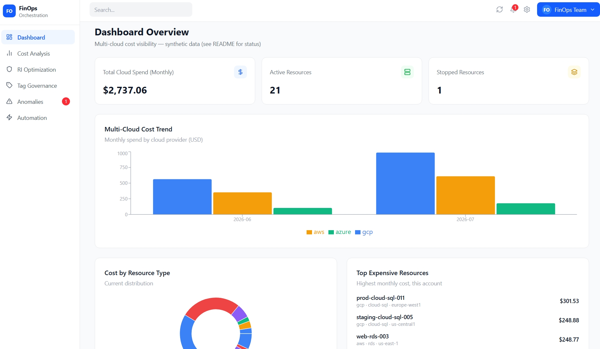
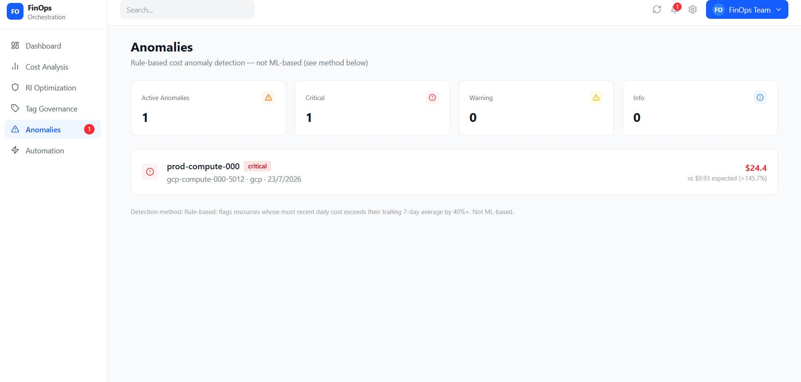
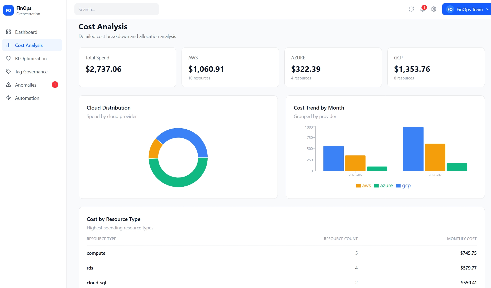

# Cost Intelligence Platform

An enterprise-style multi-cloud cost intelligence platform, built and hardened through a full production-readiness process — real Docker, Kubernetes, security, and reliability engineering, not just a working demo.

**Live:** https://cost-intelligence-platform-frontend.onrender.com
**Repo:** https://github.com/jivann/cost-intelligence-platform
**Contact:** cyberpunkjeevan@gmail.com
> Note: hosted on Render's free tier — the backend may take 30-60 seconds to respond on first load after a period of inactivity (cold start). This is a hosting-tier limitation, not an application bug.

---

## 📖 Overview

Cost Intelligence Platform is a full-stack application designed to give organizations visibility into multi-cloud spending. This repository documents not just the application itself, but the complete engineering process behind making it secure, resilient, and deployment-ready — the same standard real infrastructure teams hold production systems to.

---

## 📸 Screenshots

**Dashboard** — real-time cost data across cloud providers


**Anomaly Detection** — rule-based detection flagging a genuine cost spike


**Cost Analysis** — detailed cost breakdown, backed by real endpoints


---

## ✅ What's Actually Working Today

- **User authentication** — JWT-based login/registration, secured against common auth mistakes (form-encoded login, hashed passwords, no plaintext credentials anywhere in the codebase or git history)
- **Full containerized deployment** — frontend, backend, database, and cache all running as separate, properly isolated services
- **Production-grade infrastructure hardening** (detailed below) — this is the actual core deliverable of this project
- **Live CI/CD pipeline** — automatic build and deploy on every push
- **Live deployment** accessible via a real domain

## 🗺 On the Roadmap (Not Yet Wired to Real Data)

The dashboard includes scaffolded UI for the following — layouts and navigation exist, but they are **not yet connected to live cloud billing APIs** and should not be represented as functional to a client without saying so:

- Real-time multi-cloud cost monitoring (AWS Cost Explorer / Azure Cost Management integration)
- Cost anomaly detection and forecasting
- Resource rightsizing and idle-resource recommendations
- Tag governance and policy enforcement
- Automated remediation workflows

This is an honest, deliberate scope boundary — integrating real billing APIs across multiple cloud providers is a substantial project on its own, planned as a distinct future phase.

---

## 🏗 System Architecture

```
 Browser (HTTPS)
      │
      ▼
 Nginx Ingress Controller (cert-manager TLS)
      │
      ▼
 Frontend (React + Vite, served via Nginx)
      │  proxies /api/*
      ▼
 Backend (FastAPI, JWT auth)
      │
      ├──► PostgreSQL (persistent, backed up nightly)
      └──► Redis (cache)

 All services isolated across dedicated Kubernetes
 namespaces (frontend / backend / data) with RBAC
 and NetworkPolicies enforcing least-privilege access.
```

---

## 🛠 Technology Stack

**Frontend**
- React + Vite
- Axios for API communication
- Nginx (multi-stage build, serves static assets + reverse proxy)

**Backend**
- FastAPI (Python)
- SQLAlchemy + Alembic (migrations)
- PostgreSQL
- Redis
- JWT authentication (OAuth2 password flow)

**Infrastructure & DevOps**
- Docker (multi-stage builds)
- Kubernetes (namespace isolation, RBAC, NetworkPolicies, resource quotas)
- Calico (CNI, enables real NetworkPolicy enforcement)
- Nginx Ingress + cert-manager (TLS)
- Sealed Secrets (encrypted secrets safe to commit)
- Trivy (vulnerability scanning)
- GitHub Actions (CI/CD)
- Render (production hosting)

---

## 🚀 Getting Started (Demo Data Setup)

To see the Dashboard and Anomalies features populated with realistic data on a fresh clone:

1. **Register a user** via the app (or `POST /api/v1/register`) with the username `day8user` — this is the default target for the demo data script.
   - Using a different username? Set `SYNC_TARGET_USERNAME=<your-username>` in your `.env` file first.

2. **Run the combined setup script:**
```bash
   python -m backend.setup_demo_data
```
   This syncs 30 days of realistic mock cloud cost data and injects one deliberate cost spike so the Anomalies page has something real to detect.

3. **Log in as that user** and visit the Dashboard and Anomalies pages — both are now populated with live, queryable data (not hardcoded frontend mocks).

This is demo/dev tooling only — see [What's Actually Working Today](#-whats-actually-working-today) for what's real vs. synthetic.

## 🔒 Security & Hardening

This is the part of the project that took the most deliberate engineering effort, done in stages:

| Area | What Was Done |
|---|---|
| **Secrets management** | Purged an early plaintext secrets file entirely from git history (not just deleted — rewritten out of every commit). Adopted Sealed Secrets so credentials can be safely committed encrypted. Documented and automated credential rotation. |
| **Non-root containers** | Every container runs as a dedicated non-root user — enforced at both the Docker image level and the Kubernetes `securityContext` level (`runAsNonRoot`, dropped Linux capabilities, no privilege escalation) as defense in depth. |
| **Resource governance** | CPU/memory `requests` and `limits` on every container, plus namespace-wide `LimitRange` and `ResourceQuota` so no single workload can starve the cluster. |
| **Namespace isolation & RBAC** | Split into `frontend`, `backend`, and `data` namespaces, each with a dedicated ServiceAccount and Role scoped to only the permissions it needs. |
| **Network policies** | Deny-all default posture with explicit allow rules. Verified directly (not just assumed): frontend genuinely cannot reach PostgreSQL over the network, even if compromised. |
| **TLS everywhere** | Real HTTPS via an Nginx Ingress controller and cert-manager, replacing raw port-forwarding for local development access. |
| **Vulnerability scanning** | Trivy scans integrated into the build process. Every fixable CVE patched. Remaining OS-level CVEs with no upstream patch are documented transparently rather than hidden. |
| **Backup & disaster recovery** | Automated nightly PostgreSQL backups via CronJob, stored on a separate persistent volume from the live database. Restore process was actually executed and verified — not assumed to work. |

Full scan results and accepted-risk documentation: see `SECURITY.md` in the repository.

---

## 📂 Project Structure

```
cost-intelligence-platform/
├── backend/              FastAPI application code
├── frontend/              React frontend
│   ├── src/
│   ├── Dockerfile
│   └── nginx.conf
├── alembic/               Database migrations
├── k8s/                   Kubernetes manifests
│   ├── backend.yaml
│   ├── frontend.yaml
│   ├── postgres.yaml
│   ├── redis.yaml
│   ├── rbac.yaml
│   ├── networkpolicy-*.yaml
│   ├── ingress.yaml
│   ├── cluster-issuer.yaml
│   ├── postgres-backup.yaml
│   ├── limitrange.yaml
│   └── resourcequota.yaml
├── Dockerfile             Backend container definition
├── SECURITY.md            Vulnerability scan results & accepted risks
└── requirements.txt
```

---

## 🚀 Deployment

- **Source control:** GitHub
- **CI/CD:** GitHub Actions — automated build and deploy on push
- **Production hosting:** Render
- **Live environment:** https://cost-intelligence-platform-frontend.onrender.com

---

## 🎯 What This Demonstrates for Hiring/Client Purposes

If you're evaluating this as proof of capability rather than as a finished product, here's what it actually proves:

- Ability to take an application from "runs on my machine" to properly hardened and deployable
- Real understanding of Kubernetes security primitives (RBAC, NetworkPolicies, resource governance) — not just deploying a Pod and calling it done
- Discipline to actually test claims (backup restore, network isolation) rather than assume configuration is correct
- Comfort diagnosing real infrastructure problems under pressure (registry pull failures, CNI misconfigurations, DNS issues across WSL/Windows boundaries) — all encountered and solved during this build

---

## 📫 Contact

- **GitHub:** https://github.com/jivann/cost-intelligence-platform
- **Portfolio / Live Demo:** https://cost-intelligence-platform-frontend.onrender.com

---

## ⭐ Support

If this project is useful to you as a reference or portfolio example:
- Star the repository
- Fork it and adapt the hardening patterns for your own projects
- Reach out if you'd like to collaborate or discuss the work
